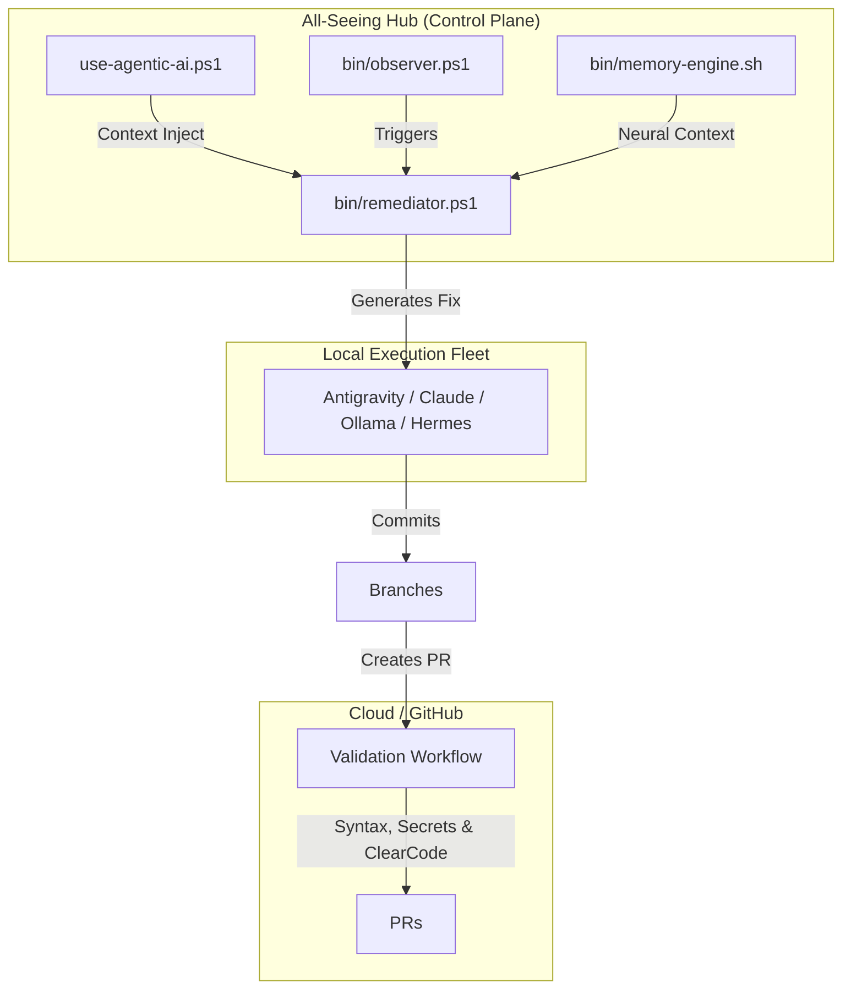

# 👁️ Agentic DevOps Hub v5.0.0 (The Neural Control Plane)

**The Ultimate God-Level Architecture for Software Engineering.**

Welcome to the unified control plane. This is not just a collection of scripts—it is an **Agentic Operating System** designed to scale across *all* your software, apps, and workflows. 

By synthesizing **Autonomous DevOps**, **Neural Continuous Learning**, **The 5-Step Engineering Algorithm**, and strict **ClearCode Verification**, this repository acts as a self-healing factory. It watches your code, isolates bugs using ephemeral git branches, cross-references past mistakes via a semantic memory bank, and dispatches strict CI-validated fixes across ANY local AI platform (Antigravity, Claude, Ollama, Hermes, OpenClaw).

## 🚀 Key v5.0.0 Features

1. **The Universal Autonomous Builder (`use-agentic-ai.ps1`)**
   A state-of-the-art CLI router that dynamically injects project architecture, git status, and Neural Memory into prompts before dispatching them to the best available AI agent.
2. **Auto-Remediation Mode (`-Mode auto`)**
   One-shot background scanning across multi-language projects (Bash, Python, JSON). Finds errors and auto-dispatches agents to fix, branch, and commit without human intervention.
3. **The 5-Step Engineering Algorithm Hardcoded**
   Agents are instructed to: 1. Question requirements 2. Delete unnecessary parts 3. Simplify & optimize 4. Accelerate cycle time 5. Automate.
4. **Validation & Quality Gates (`.github/workflows/validation.yml`)**
   Ensures no PR generated by the AI or humans can be merged without passing syntax verification, a secret leak detection check, and ClearCode structural validation.

## 🛠️ Getting Started

### The 5 Magic Commands

This repository revolves around a single, powerful wrapper command: `.\bin\use-agentic-ai.ps1`. Run it from anywhere.

| Command | What it does |
|:---|:---|
| `.\bin\use-agentic-ai.ps1 "Build X"` | **BUILD**: Standard generation with God-Level strict rules |
| `.\bin\use-agentic-ai.ps1 -Mode fix "Fix Y"` | **SURGERY**: Focused, minimal-diff bug repairs |
| `.\bin\use-agentic-ai.ps1 -Mode auto` | **AUTONOMY**: Scans the repo, finds errors, and auto-fixes them |
| `.\bin\use-agentic-ai.ps1 -Mode observe` | **WATCHDOG**: Runs forever, guarding your repos in the background |
| `.\bin\use-agentic-ai.ps1 -Mode status` | **DASHBOARD**: See memory health, agents, and loaded projects |

## 🏗️ Architecture: The All-Seeing Setup

This setup transforms your workspace into a self-healing, autonomous software factory.

## 🌍 State-of-the-Art Agentic Ecosystem

This repository is designed to be extensible and compatible with the "god-level" frontier of AI engineering. To expand this repo's capabilities or explore advanced orchestration patterns, consider integrating or learning from these state-of-the-art repositories:

### Multi-Agent Orchestration
*   **[LangGraph](https://github.com/langchain-ai/langgraph)**: Stateful, resilient orchestration for complex, long-running agent workflows.
*   **[CrewAI](https://github.com/joaomdmoura/crewAI)**: Collaborative multi-agent teams with specific roles and capabilities.
*   **[AutoGen](https://github.com/microsoft/autogen)**: Multi-agent conversational framework for self-healing and code generation.
*   **[OpenHands](https://github.com/All-Hands-AI/OpenHands)**: Autonomous platform capable of executing end-to-end software engineering tasks.

---

> **📖 Want the detailed manual?** Check out the [How To Use Guide](docs/HOW_TO_USE.md).
>
> **🌍 Want to use this for ALL your future projects?** Read the [Global System Design](SYSTEM_DESIGN.md).

## ⚡ v5.0.0 Updates
- **Global Activation**: Use . .\activate.ps1 to alias gentic and hub globally in your terminal.
- **Core File Handler System**: in\file-handler.ps1 safely manages read, write, and backup operations for agents to prevent accidental data loss.

## 🚀 v5.0.0 Architecture Overhaul
- **Pure PowerShell Ecosystem**: Eradicated Bash dependencies. Full cross-platform native execution.
- **Event-Driven Observer**: Moved from slow polling to FileSystemWatcher. Errors are detected in milliseconds upon file save.
- **Dynamic Linking**: Use gentic -Mode link to seamlessly register new spoke projects into the hub.

## 🏎️ v5.0.0 HFT-Speed Edition
- **Zero-Latency I/O**: Swapped slow PowerShell cmdlets for native .NET [System.IO.File] operations in the File Handler, yielding 10-100x speedups.
- **Debounced Multithreaded Observer**: The event observer now uses a ConcurrentDictionary to debounce rapid save events (like VS Code auto-save) and dispatches validation to background Runspaces so the main thread never blocks.

## 📐 v6.1.1 Engineering & Economics Overhaul
- **Buffer Overflow Protection**: The HFT Observer now uses the maximum 64KB OS buffer to handle 10,000+ simultaneous file changes (e.g., 
pm install). If the buffer still overflows, it automatically catches the Error event and triggers a full fallback reconciliation scan.
- **Universal Unix Bootstrapper**: Added setup.sh which automatically detects your macOS/Linux distro and gracefully installs pwsh for you, closing the cross-platform dependency gap.
- **Token Economics (Cost Saving)**: 
  - Reduced Project Map context window by 62%.
  - Truncated Git Diff injection by 60%.
  - Restricted Neural Memory injection to the single most relevant prior error.

## 🎛️ v6.1.1 Hyperparameter Tuning
- **Explicit Tuning Blocks**: All hardcoded logic and magic numbers (OS buffer sizes, context token limits, debounce milliseconds) have been extracted to explicit HYPERPARAMETERS blocks at the absolute top of the core scripts. Developers can now easily tune the system's latency and token economics without digging into core logic.

## 🐝 v7.0.0 True Agent Swarming & Orchestration
- **Adversarial Swarm Topology**: The 
emediator.ps1 script no longer relies on a single LLM output. It is now a true **Swarm Orchestrator**. 
- When an error is detected, the Hub spawns **The Surgeon** agent to generate a fix, and immediately pipes that code into **The Gatekeeper** agent for an adversarial code-review. The code is only written to disk once the Swarm reaches consensus.

## 🧠 v11.0.0 Neural Pattern Integrity
- **Fuzzy Hashing**: The Memory Ledger now strips ephemeral data (line numbers, file paths) to generate stable Semantic Signatures.
- **Self-Healing Ledger**: Added in\integrity-check.ps1 to automatically purge corrupted memory nodes.

## 🌍 v12.0.0 Universal Engine Integration
- **Multi-Language Swarm**: The Orchestrator natively understands, checks, and patches .js (Node), .ts (TypeScript), and .go (Golang) alongside Python and PowerShell.
