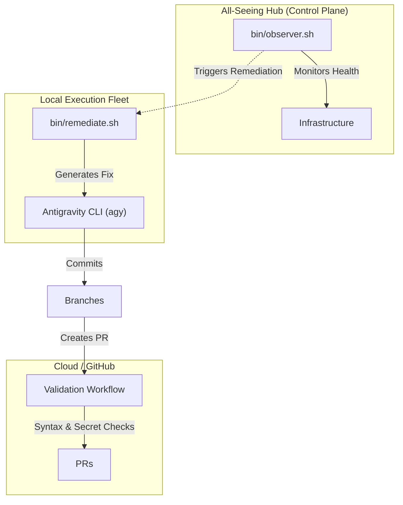

# 👁️ All-Seeing Agentic DevOps Hub

Welcome to your unified control plane. This hub synthesizes the principles of **Autonomous DevOps (`agenticsorg/devops`)** and **Agentic Gen-AI** into a single, all-seeing ecosystem that orchestrates automated monitoring, AI-driven remediation, and strict CI/CD validation.

## 🏗️ Architecture: The All-Seeing Setup

This setup transforms your workspace into a self-healing, autonomous software factory.



## 🚀 Key Components

1. **Self-Healing DevOps Loop (`bin/observer.sh`)**
   - An always-on watcher that monitors system health (currently tracking bash script syntax errors).
   - When something breaks, it doesn't page you; it triggers the remediation pipeline.

2. **Autonomous Remediation (`bin/remediate.sh`)**
   - Automatically isolates the failing code in a fresh git branch.
   - Spawns the local Antigravity CLI (`agy`) agent to attempt to fix the error and commit the solution.

3. **Validation & Quality Gates (`.github/workflows/validation.yml`)**
   - Ensures no PR generated by the AI or humans can be merged without passing syntax verification and a secret leak detection check.

## 🛠️ Getting Started

### 1. Setup the Environment
Ensure your project is a Git repository and you have the Antigravity CLI (`agy`) installed to power the remediation agent.

### 2. Start the All-Seeing Observer
Run the local DevOps self-healing loop in the background:
```bash
./bin/observer.sh --start
```

### 3. Test the Self-Healing Pipeline
Introduce a deliberate syntax error into any script in `bin/` and watch the observer catch it, spawn a remediation branch, fix it, and prepare it for validation!

## 🌍 State-of-the-Art Agentic Ecosystem

This repository is designed to be extensible and compatible with the "god-level" frontier of AI engineering. To expand this repo's capabilities or explore advanced orchestration patterns, consider integrating or learning from these state-of-the-art repositories:

### Multi-Agent Orchestration
*   **[LangGraph](https://github.com/langchain-ai/langgraph)**: Stateful, resilient orchestration for complex, long-running agent workflows.
*   **[CrewAI](https://github.com/joaomdmoura/crewAI)**: Collaborative multi-agent teams with specific roles and capabilities.
*   **[AutoGen](https://github.com/microsoft/autogen)**: Multi-agent conversational framework for self-healing and code generation.
*   **[OpenHands](https://github.com/All-Hands-AI/OpenHands)**: Autonomous platform capable of executing end-to-end software engineering tasks.

### Workflow & Skills Integration
*   **[GitHub Agentic Workflows](https://github.com/github/agentic-workflows)**: Bringing autonomous agents directly into GitHub Actions.
*   **[Agent Skills](https://github.com/addyosmani/agent-skills)**: A curated set of production-grade engineering skills for agent use.
*   **[Agent Orchestrator](https://github.com/AgentWrapper/agent-orchestrator)**: Manage fleets of parallel coding agents with automated CI/CD feedback loops.
*   **[ECC (Agent Harness OS)](https://github.com/affaan-m/ecc)**: The harness-native operator system for agentic work.

---

> **📖 Want to build the ultimate terminal-centric workspace?**
> Check out the [Workflow & Core Tool Stack Roadmap](WORKFLOW.md) for a complete guide on scaling your setup with tmux, Neovim, treehouse, firstmate, and no-mistakes.
> 
> **🧠 How do we compare to the state-of-the-art?**
> Read our [ECC Integration & Architecture Comparison](ECC_INTEGRATION.md) to see how we consume tools like ECC to create a god-level macro-orchestrator.
